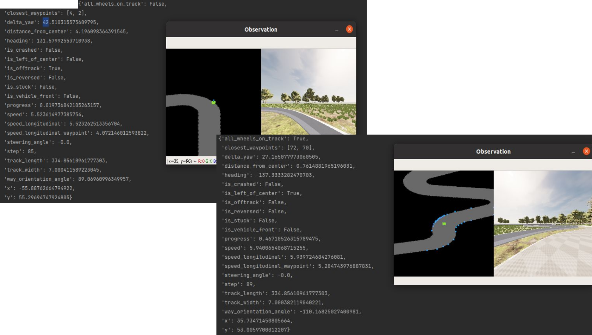
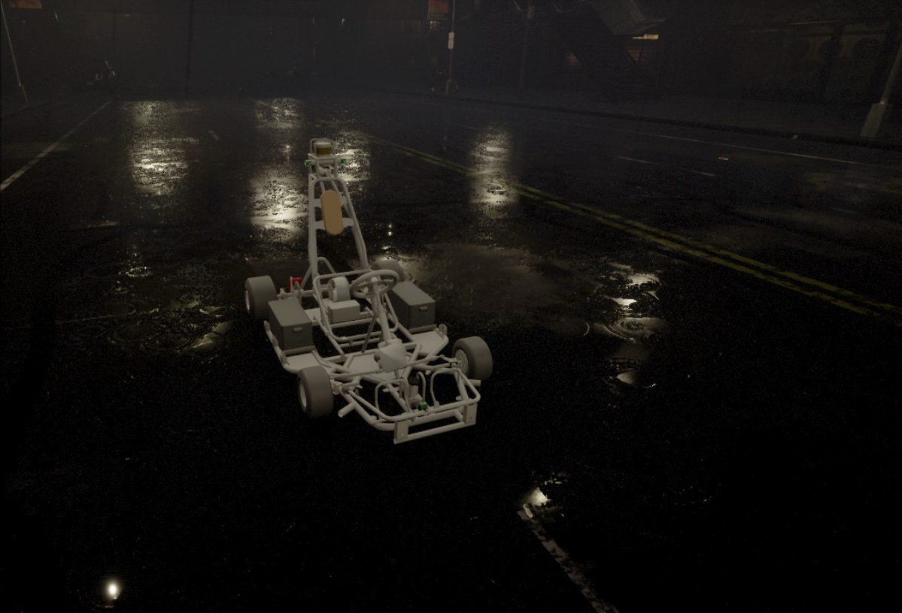
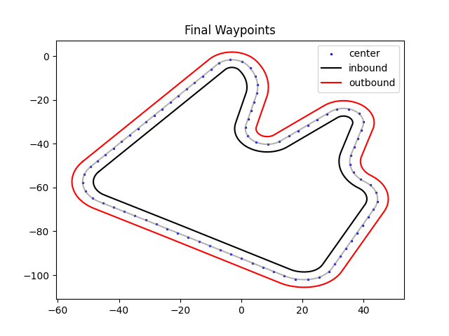
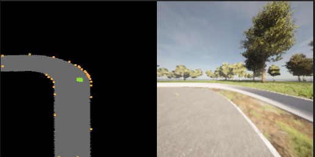

# CarlaGym: DeepRacer

We developed a solution for efficient and stable integration of RLLib with Carla simulator. Here we present end2end solution for learning self-driving cars in Carla simulation environment with GYM-interface. The interface handles the deepracer like mechanism for reward shaping and multi-environment data collection. The carla simulator is enriched with new track and a custom racing cart.

### Advantages of Carla Gym interface 
Main advantages over the other Gym interfaces for Carla are listed below.

- Compute state per each step.
- Standalone reward function, that is tight with config.
- Inverted server creation per actor-agent
- Virtual lidar construction
- advanced integration with RlLib
- Deepracer style training with stop_iteration or stop_duration parameters
- Edge distance LiDAR (virtual LiDAR): there we introduce a wrapper `tools/bew/virtual_lidar.py` over the package 'carla_birdeye_view'.
The module generates a parametrised array of distances around the ego-car.

Ego-states passed to a detached reward function.
<div align="left">
  
</div>

## Components of CarlaGym-Deepracer

1. CarlaCore 
   1. init_server, stop_server;
   2. connect_client;
   3. agent snapshot (deepracer).
2. CarlaEnv (GYM)
   1. basic sensors set-up (camera, crash sensor, edge -distance lidar (vlidar) and others)
   2. actions set-up;
   3state set-up.
3. Wrappers for data normalisation, metrics computation.
4. Simple reward function injection mechanism. 
   1. Experiment gym interface independent snapshot as parameters for reward.
   2. Make easy reward shaping with changing the name of reward functions stored in `tools/gymcustom/gym_carla/rewards`.
5. Inverted server creation by each gym-client.
6. Very similar to Deepracer with reward shaping, waypoints. Also, we introduce track and a cart for racing without any traffic signs.
7. Our custom track: "expedition_loop"".
8. Our custom racing car.

Our kart for racing
<div align="left">
  
</div>

Demo Gym-interface for carla
```bash
make demo_gym
```

## Prepare environment

Download custom carla simulator with our track and cart.
```bash
docker pull docetti/carla:0.9.13-1
```

Prepare training environment
```bash
# Python3.8 >=
python3 -m venv venv
source venv/bin/activate
pip install --upgrade pip wheel setuptools
pip install -r requirements.txt

# CUDA 11.6
pip install torch==1.12.1+cu116 --extra-index-url https://download.pytorch.org/whl/cu116
# CUDA 11.3
pip install torch==1.12.1+cu113 --extra-index-url https://download.pytorch.org/whl/cu113
# CUDA 10.2
pip install torch==1.12.1+cu102 --extra-index-url https://download.pytorch.org/whl/cu102
```


## Training

Look in [control](./control/README.md) folder

We designed a specific closed track for racing purpose. It's already included in carla docker image.
<div align="left">
  
</div>

## Demo gym interface

Before running a demo you should run a server with `make sim_run` or `make sim_render_run` command.
<div align="left">
  
</div>

```bash
# off-screen carla on ports 2000, 2001 and 2022
make sim_run
# stop off-screen carla and switch off the server
make sim_stop
# render carla track & open port 2000, 2001 and 2022
make sim_render
# stop render carla track and switch off the server
make sim_render_stop
```


